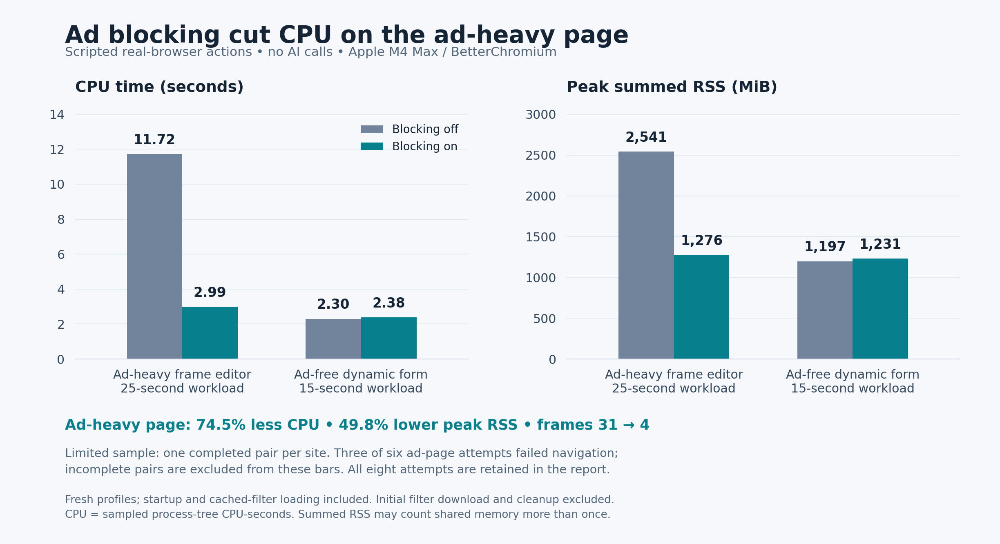

# Ad blocking: scripted CPU comparison

The PR enables blocking by default; `--no-ad-block`, `{ adBlock: false }`, or `BETTERWRIGHT_AD_BLOCK=0` opts out. The benchmark explicitly set each mode.

Blocking reduced CPU from **11.72 to 2.99 seconds (74.5%)** in the one completed on/off pair on the ad-heavy frame editor. Peak summed RSS fell **49.8%, from 2,541 to 1,276 MiB**, and the page had 4 frames instead of 31. Both single-frame and nested-frame edits were read back correctly.

This is a limited observation, not a general performance guarantee. Three of six frame-page attempts failed navigation. There was only one complete pair; one additional blocking-on attempt succeeded with 3.05 CPU-seconds. All eight attempts, including failures and the unmatched success, remain in the raw data.

| Completed pair | CPU off / on | Peak summed RSS off / on | Verified actions |
|---|---:|---:|---|
| Ad-heavy frame editor, 25-second workload | 11.72 / 2.99 s | 2,541 / 1,276 MiB | Single and nested input edits, both modes |
| Ad-free dynamic form, 15-second workload | 2.30 / 2.38 s | 1,197 / 1,231 MiB | Enable and fill input, both modes |

The control's CPU increased 3.5% and RSS increased 2.8%; this quick sample cannot establish a meaningful CPU difference there. A filter engine has its own memory cost, while blocking a heavy ad page can save much more browser memory.

## Method

- **No model was used and no AI API calls were made.** Deterministic Playwright scripts operated BetterWright's actual guarded browser worker.
- Ad page: https://demo.automationtesting.in/Frames.html. Control: https://the-internet.herokuapp.com/dynamic_controls.
- Three ad-page pairs in off/on, on/off, off/on order; one control pair off/on. No failed attempts were replaced. The chart includes only pairs in which both full workloads and action readbacks completed.
- Fresh browser profile/home for every trial; same pinned Ghostery 2.18.2 filter cache, containing 120,321 network filters and 36,929 cosmetic filters. Same browser, headless setting, and script in both modes. Parking was disabled equally to expose active-page CPU during the fixed dwell.
- Apple M4 Max, macOS 27.0, Bun 1.4.0, native BetterChromium 151.0.7922.108. This compares the PR with blocking off versus on, not a new stable-release comparison.
- Sampled driver/worker/browser descendant process CPU and summed RSS every 250 ms. Startup and cached-engine deserialization are included. The one-time filter download/parse (observed 0.57 seconds), sampler, final cleanup, and other applications are excluded. CPU is cumulative CPU-seconds, not an Activity Monitor percentage. Short-lived processes can be missed; shared pages may be counted more than once in summed RSS.
- Dwell starts immediately before navigation inside the snippet. Completed ad workloads took about 27.5–27.7 seconds including cold startup; control runs took about 16.3–16.4 seconds. Failed navigation runs ended early and therefore cannot support CPU savings claims.
- The first off trial exceeded BetterWright's result-size limit because ad URLs contained long query strings. Its unchanged preview retains the full URL/title, input values, errors, and frame count before the truncated resource list; these fields were recovered verbatim for validation. Missing resource entries were not reconstructed. The CPU samples are independent of this output limit. The harness subsequently added only an after-timing copy of oversized output files; measured actions were unchanged.
- Measurements used the implementation before a warning-delivery and best-effort temporary-cache-cleanup adjustment. Neither path occurs in these successful fresh-cache trials. Source revision and filter checksum are in the metadata.

## All attempts

| Task | Repeat | Blocking | CPU seconds | Peak RSS MiB | Outcome |
|---|---:|---|---:|---:|---|
| frames | 1 | off | 11.72 | 2541 | verified |
| frames | 1 | on | 2.99 | 1276 | verified |
| frames | 2 | on | 2.92 | 1180 | goto: net::ERR_SOCKET_NOT_CONNECTED at https://demo.automationtesting.in/Frames.html |
| frames | 2 | off | 3.32 | 1214 | goto: Timeout 18000ms exceeded. |
| frames | 3 | off | 3.35 | 1187 | goto: Timeout 18000ms exceeded. |
| frames | 3 | on | 3.05 | 1290 | verified |
| control | 1 | off | 2.30 | 1197 | verified |
| control | 1 | on | 2.38 | 1231 | verified |

The deterministic browser regression also verifies network rules, filter exceptions, cosmetic hiding, nested frames, popup subresources, service-worker registration blocking, local redirect resources, and that policy-denied URLs cannot be allowed by filter exceptions or redirects.

[All metrics](results.json) · [CSV](results.csv)
